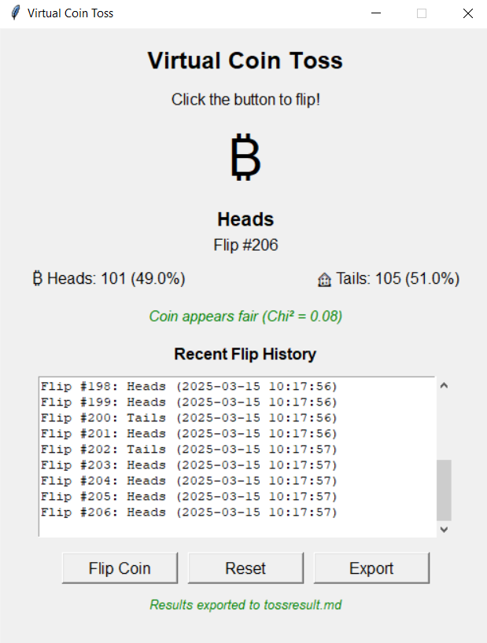

# Virtual Coin Toss

A Python-based virtual coin toss application with a graphical user interface (GUI). The program simulates a fair coin flip, tracks statistics, and exports results.

## Features

- **Simple GUI**: Built with Tkinter for an easy-to-use interface.
- **Randomized Tosses**: Uses Python’s `random.choice()` to simulate unbiased flips.
- **Statistics Tracking**: Displays flip count, heads/tails percentage, and fairness evaluation.
- **Fairness Check**: Uses a chi-square test to determine if the coin is biased.
- **Flip History**: Logs the last 20 flips in a scrollable text box.
- **Export Results**: Saves flip data to a `tossresult.md` file.
- **Reset Function**: Clears all data and starts fresh.

## Installation

1. **Clone the repository**:
   ```sh
   https://github.com/official-imvoiid/PyInMotion.git
   cd PyMotionProject4
   ```

2. **Install dependencies** (if not already installed):
   ```sh
   pip install tk
   ```

3. **Run the application**:
   ```sh
   python CoinToss.py
   ```

## Usage

1. Click **"Flip Coin"** to generate a random result.
2. View the flip history and statistics in real time.
3. Click **"Export"** to save results to `tossresult.md`.
4. Click **"Reset"** to clear all data.

## Screenshot



## How the Fairness Test Works

- Uses a **Chi-square test** to evaluate fairness:
  - If `Chi² < 3.84`, the coin appears fair.
  - If `Chi² ≥ 3.84`, the coin may be biased.

## File Overview

- **CoinToss.py** → Main script handling the GUI and coin toss logic.
- **Gui.png** → Screenshot of the application.
- **tossresult.md** → Automatically generated file with coin toss results.

## License

This project is open-source under the [MIT License](LICENSE).